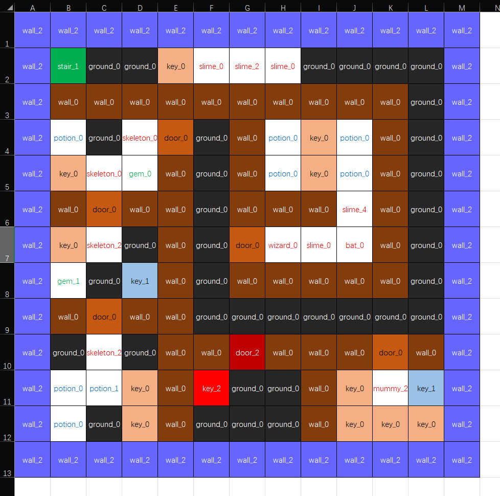

# 文档

## 可用资源

所有可用图片资源请查看`/docs/resources.md`，每种资源的都有对应的id，生成到了`/rtl/parameters/resources_params.v`，命名方式是`RS_资源名_i`其中`i`是每张图中从左到右，从上到下，编号的顺序。

## 添加资源

在`/script/gen_maps.py`中添加。然后用`make`重新生成。

## 地图编辑

使用`/resources/map_editor.xlsx`编辑地图。

地图大小是`13 * 13`，最外围用墙围起来（不围也行，有做边界处理）。编辑好的地图用`make`或者`/script/gen_maps.py`生成。
